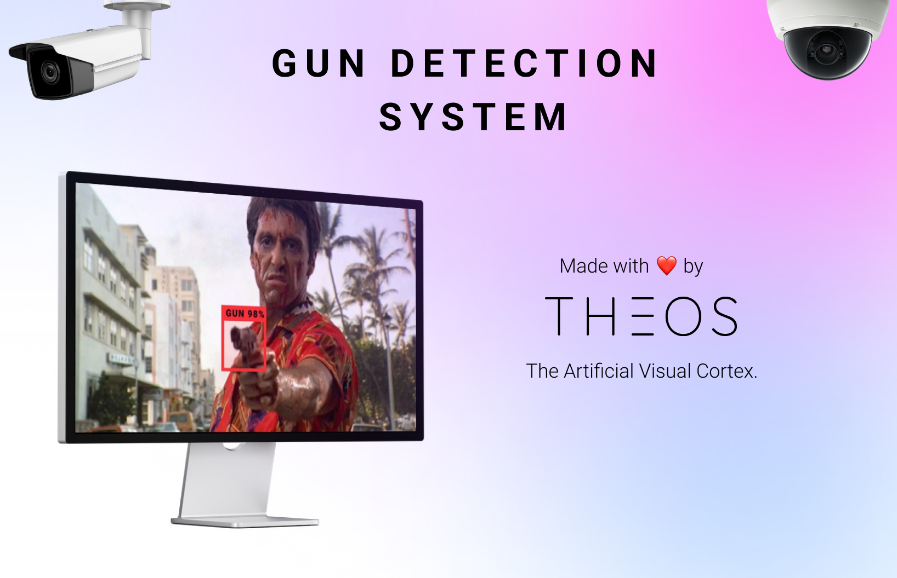

# Gun Detection System



This is a Gun Detection System built using YOLOv7 in Python, made with ❤️ by [Theos AI](https://theos.ai).

Don't forget to read the [Blog Post](https://blog.theos.ai/articles/how-to-train-yolo-v7-on-a-custom-dataset-for-gun-detection-in-security-cameras-with-python) and watch the [YouTube Video](https://www.youtube.com/watch?v=MorMkGS6_WU)!

Make sure you have a camera connected to your computer, then run the following commands to start detecting guns.

### Install all the dependencies

```
pip install -r requirements.txt
```

### Copy and paste your Theos deployment URL inside run.py

``` python
URL = '<your-deployment-url>'
```

### Start the program

```
python run.py
```